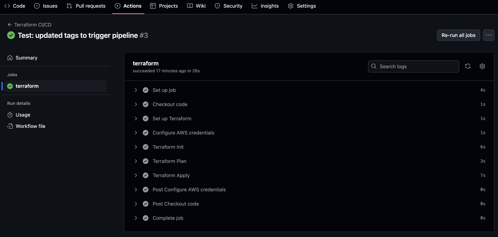
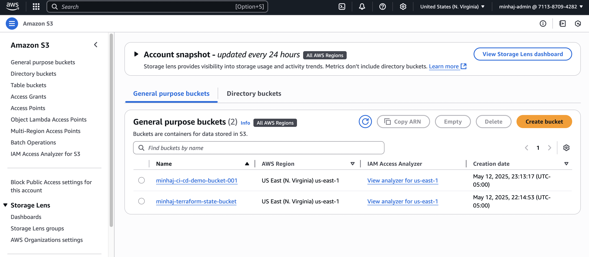
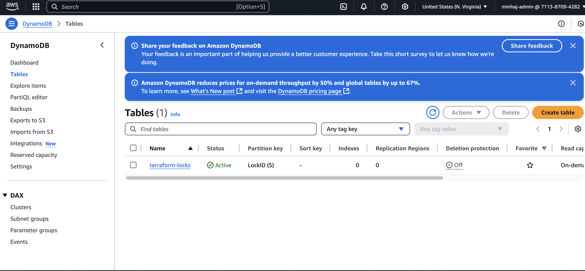

# Terraform CI/CD with GitHub Actions on AWS

This project sets up a basic CI/CD pipeline using Terraform and GitHub Actions. Every time I push changes to the repo, Terraform automatically deploys infrastructure to AWS. It uses an S3 bucket for remote state and a DynamoDB table for locking.

## What's Inside

- Terraform code to provision an S3 bucket
- GitHub Actions workflow to automate `terraform init`, `plan`, and `apply`
- Remote backend using S3 and DynamoDB (manually created ahead of time)

## How It Works

1. I write or update Terraform code
2. I push to the `main` branch
3. GitHub Actions runs:
   - `terraform init`
   - `terraform plan`
   - `terraform apply` (auto-approved)
4. Terraform provisions or updates AWS resources

## Backend Setup (done manually)

Before using the pipeline, I created:

- **S3 bucket** for remote state: `minhaj-terraform-state-bucket`
- **DynamoDB table** for locking: `terraform-locks`

Commands I used:

```bash
aws s3api create-bucket --bucket minhaj-terraform-state-bucket --region us-east-1

aws s3api put-bucket-versioning --bucket minhaj-terraform-state-bucket \
  --versioning-configuration Status=Enabled

aws dynamodb create-table \
  --table-name terraform-locks \
  --attribute-definitions AttributeName=LockID,AttributeType=S \
  --key-schema AttributeName=LockID,KeyType=HASH \
  --billing-mode PAY_PER_REQUEST


 ## 📸 Screenshots

### GitHub Actions – Workflow Runs

Shows that the CI/CD pipeline is automatically triggered on push.


---

### CI/CD Pipeline – Terraform Commands

This run shows the pipeline running `terraform init`, `plan`, and `apply`.



---

### S3 Buckets Created by Terraform

You can see both the application S3 bucket and the backend state bucket created in AWS.



---

### DynamoDB Table for State Locking

Shows the `terraform-locks` table used by Terraform to manage backend state locking.

